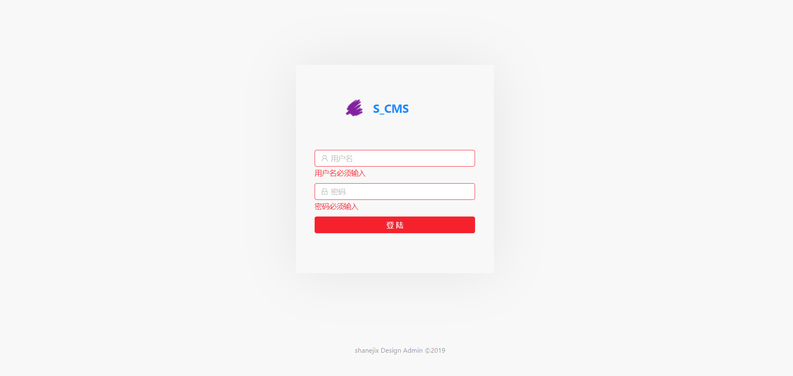
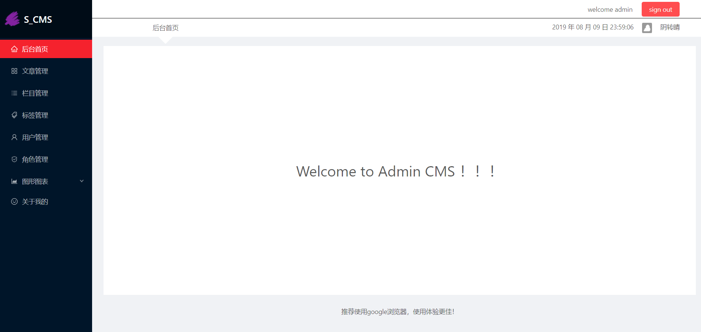
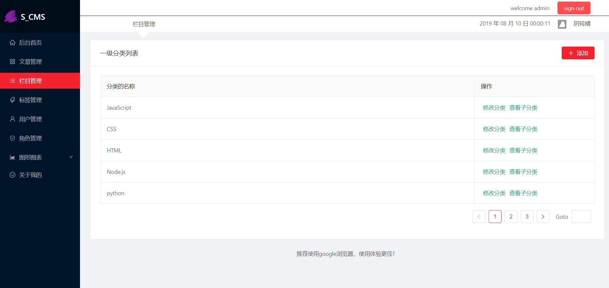
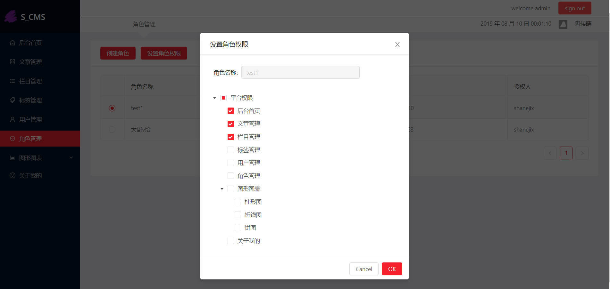

# reactblog-front

展示：










# 遇到的问题

## 一，Antd中From的高阶组件

一般的登录框

```js
<form action="action_page.php">
    First name:<br>
    <input type="text" name="firstname" value="Mickey">
    <br>
    Last name:<br>
    <input type="text" name="lastname" value="Mouse">
    <br><br>
    <input type="submit" value="Submit">
</form> 
```

AntD具有数据**收集**、**校验**和**提交**功能的表单的功能，假设上述登录框为react的一个组件

1. 包装组件:**Form.create()()**高阶函数

```js
const WrappedLoginForm = Form.create({ name: 'horizontal_login' })(HorizontalLoginForm);

```

**Form.create()()**高阶函数返回一个高阶组件（函数），将将被包装组件传入，包装组件将获得**form**对象

```js
...
  render() {
    const { getFieldDecorator } = this.props.form;
    return 
  }
}
...
```

通过this.props.from结构必要的方法

- ```getFieldValue()```
- ``getFieldsValue()``
- ```getFieldDecorator()```

2. 收集，校验数据

```js
<Form.Item>
    {getFieldDecorator("username", {
        rules: [
            {
                required: true,
                message: "Please input your username!"
            },
            {
                min: 6,
                message:
                    "username must more than 6 letters"
            },
            {
                max: 12,
                message:
                    "username must less than 12 letters"
            },
            {
                pattern: /^[0-9a-zA-Z_]+$/,
                message:
                    "username can not have special characters "
            }
        ]
    })(
        <Input
            prefix={
                <Icon
                    type="user"
                    style={{ color: "rgba(0,0,0,.25)" }}
                />
            }
            placeholder="Username"
        />
    )}
</Form.Item>
```

通过```getFieldDecorator("username", {rules: []})```收集和验证


## 二，跨越

常见的跨越方式

- JSONP（限制GET方式）
- CORS（结合后端）
- Proxy代理

使用create-react-app脚手架的代理实现跨域


## 三，axios封装中错误处理

```js
import axios from 'axios'
import { message } from 'antd';

let ajax = (url, data = {}, type = "GET") => {
    return new Promise((resolve, reject) => {
        let promise;
        if (type === 'GET') {
            promise = axios.get(url, { params:data })
        }
        if (type === 'POST') {
            promise = axios.post(url, data)
        }

        promise.then(result => {
            message.success('request success')
            resolve(result)
        }).catch(e => {
            message.error('request error'+e.message);
        })
    })
}
export default ajax;
```

集中处理错误，避免二次封装频繁处理错误


## 四，数据配置列表项

数据：

```js
[
  {
    title: '首页', 
    key: '/home', 
    icon: 'home', 
    isPublic: true, 
  },
  {
    title: '商品',
    key: '/products',
    icon: 'appstore',
    children: [ // 子菜单列表
      {
        title: '品类管理',
        key: '/category',
        icon: 'bars'
      },
      {
        title: '商品管理',
        key: '/product',
        icon: 'tool'
      },
    ]
  },
...
]
```

渲染：

```js
mapMenuList = (menus) => {
	return (
		<Menu
			defaultOpenKeys={['sub1']}
			selectedKeys={['/home']}
			mode="inline"
			theme="dark"
		>
			{
				menus.map(menu => {

					if (!menu.children) {
						return (
							<Menu.Item key={menu.key}>
								<Link to={menu.key}>
									<Icon type={menu.icon} />
									<span>{menu.title}</span>
								</Link>
							</Menu.Item>
						)
					} else {
						return (
							<SubMenu
								key={menu.key}
								title={
									<span>
										<Icon type={menu.icon} />
										<span>{menu.title}</span>
									</span>
								}
							>
								{this.mapMenuList(menu.children)}
							</SubMenu>
						)
					}
				})
			}
		</Menu>
	)
}
```

用数据配置列表项，用到了递归


## 五，withRouter路由管控

`withRouter()`高阶组件，包装非路由组件得到三个属性

- history
- location
- match


二，向目标组件传递参数

```js
//路由组件
this.props.history.push('/admin',{sss});

//目标组件
const {sss} this.props.history
```


## 六，defaultSelectedKeys和selectedKeys，动态打开列表项

selectedkeys推荐使用，可以动态渲染选定项

动态打开列表项：需要在数据map的同时判断当前item是否有孩子对象，并且孩子对象的key与当前的pathname匹配

- 数据map；找到defaultopenkey应该在render()之前完成
- 避免重复计算，之间在compoWillMount()中执行数据map和计算defaultkey


## 七，同步和异步数据

同步的数据:内存中的，本地计算的

- 不建议放在state中，直接处理，
- 看情况放在第一次加载`componentWillMount()`中处理

异步数据：Promise ,async..

- 一般放在`componentDidMount()`中处理，然后更新state中定义的数据，达到同步渲染目的

## 八，setstate()

`setState()`可以是同步的也可以是异步的

执行setState的位置有关

- react相关的回调中
  - react事件监听
  - 生命周期函数
- 非react相关
  - 原生dom监听
  - 定时器
  - Promise

关于异步setState()

- seState({})
- setState(fn)

setState(fn)中的state保证为最新的

如何得到异步更新状态后的数据？=》setState的第二个参数：回调函数


## 九，父子组件间通信

props：

- 父组件传入函数，子组件传入参数，父组件调用

父组件调用子组件的方法

- ref

## 十，

```js
/*
搜索商品分页列表 (根据商品名称/商品描述)
searchType: 搜索的类型, productName/productDesc
 */
export const reqSearchProducts = ({pageNum, pageSize, searchName, searchType}) => ajax(BASE + '/manage/product/search', {
  pageNum,
  pageSize,
  [searchType]: searchName,
})
```


## 十一，

`dangerouslySetInnerHTML`


## 十二，Promise，async和await

product home

```js

//通过多个await方式发多个请求: 后面一个请求是在前一个请求成功返回之后才发送
const result1 = await reqCategory(pCategoryId) // 获取一级分类列表
const result2 = await reqCategory(categoryId) // 获取二级分类
const cName1 = result1.data.name
const cName2 = result2.data.name
      

// 一次性发送多个请求, 只有都成功了, 才正常处理
const results = await Promise.all([reqCategory(pCategoryId), 		          reqCategory(categoryId)])
const cName1 = results[0].data.name
const cName2 = results[1].data.name
```

add-update

async的返回值是一个promise对象

```js
  /*
  异步获取一级/二级分类列表, 并显示
  async函数的返回值是一个新的promise对象, promise的结果和值由async的结果来决定
   */
  getCategorys = async (parentId) => {
    const result = await reqCategorys(parentId)   // {status: 0, data: categorys}
    if (result.status===0) {
      const categorys = result.data
      // 如果是一级分类列表
      if (parentId==='0') {
        this.initOptions(categorys)
      } else { // 二级列表
        return categorys  // 返回二级列表 ==> 当前async函数返回的promsie就会成功且value为categorys
      }
    }
  }
  
  
  
  
  /*
  用加载下一级列表的回调函数
   */
  loadData = async selectedOptions => {
    // 得到选择的option对象
    const targetOption = selectedOptions[0]
    // 显示loading
    targetOption.loading = true

    // 根据选中的分类, 请求获取二级分类列表
    const subCategorys = await this.getCategorys(targetOption.value)
    // 隐藏loading
    targetOption.loading = false
    // 二级分类数组有数据
    if (subCategorys && subCategorys.length>0) {
      // 生成一个二级列表的options
      const childOptions = subCategorys.map(c => ({
        value: c._id,
        label: c.name,
        isLeaf: true
      }))
      // 关联到当前option上
      targetOption.children = childOptions
    } else { // 当前选中的分类没有二级分类
      targetOption.isLeaf = true
    }

    // 更新options状态
    this.setState({
      options: [...this.state.options],
    })
  }

```


## 十三，受控组件

实时收集数据

- state
- onchange


## 14.shouldComponentUpdate

Component存在的问题?

- 父组件重新render(), 当前组件也会重新执行render(), 即使没有任何变化
- 当前组件setState(), 重新执行render(), 即使state没有任何变化

解决Component存在的问题

- 原因: 组件的componentShouldUpdate()默认返回true, 即使数据没有变化render()都会重新执行
- 办法1: 重写shouldComponentUpdate(), 判断如果数据有变化返回true, 否则返回false
- 办法2: 使用PureComponent代替Component（一般都使用PureComponent来优化组件性能）

PureComponent的基本原理

- 重写实现shouldComponentUpdate()
- 对组件的新/旧state和props中的数据进行浅比较, 如果都没有变化, 返回false, 否则返回true
- 一旦componentShouldUpdate()返回false不再执行用于更新的render()

 ## 15.redux

多个组件共享状态


## 16.hasRouter和boweRouter